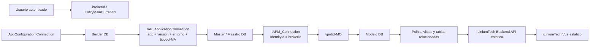

# AppBuilder: flujo maestro, broker, modelo y polizas

Fecha de analisis: 2026-05-13.

Este documento resume el analisis de `C:\Desarrollo\AppBuilder` para que futuras IAs y desarrolladores puedan continuar iLiniumTech sin perder el contexto. El objetivo no es copiar AppBuilder ni su runtime dinamico, sino entender como resuelve el origen de datos correcto por usuario/broker y como llega a los datos de polizas.

## Aviso de seguridad

Durante el analisis aparecieron cadenas de conexion reales en mensajes del usuario y en zonas de test/scaffold de AppBuilder. No se copian en este repositorio.

Reglas para futuras IAs:

- No pegar connection strings, usuarios, passwords, tokens ni claves en documentacion, tests o commits.
- Tratar cualquier credencial vista durante este analisis como comprometida y rotarla fuera del repositorio.
- En iLiniumTech, leer secretos desde variables de entorno, secret store o el mecanismo corporativo que se defina.
- Al escribir logs, errores o trazas, redactar siempre servidor, base de datos, usuario, password y claims cifrados.

## Conclusion ejecutiva

El campo que el usuario ha llamado `CurrentBrokerId` corresponde en AppBuilder al broker/entidad activa del usuario:

- Backend: `IapmUser.EntityMainCurrentId`.
- Request de login/cambio de perfil: `brokerId`.
- Frontend Vuex: `currentBrokerId`, calculado desde `user.entityMainCurrentId`.
- Tabla de conexiones master: `IAPM_Connection.IdentityId`.

La base de datos de modelo no debe elegirse por una unica connection string fija. El flujo correcto es:

1. Identificar la aplicacion, version y entorno.
2. Abrir Builder con la conexion inicial de configuracion.
3. En Builder, leer `IAP_ApplicationConnection` para localizar la conexion `tipobd-MA` de Master/Maestro.
4. Abrir Master.
5. En Master, buscar `IAPM_Connection` por `IdentityId == brokerId`.
6. Seleccionar la fila `DatabaseTypeId == tipobd-MO`.
7. Usar esa conexion de modelo para consultar tablas/vistas de polizas.

AppBuilder usa metadata y CRUD generico para montar pantallas en runtime. iLiniumTech no debe hacerlo. iLiniumTech debe reutilizar solo el conocimiento de resolucion de conexion y permisos; las pantallas Vue y endpoints backend de polizas deben quedar programados como codigo estatico y mantenible.

## Mapa conceptual

## Repositorio analizado

La ruta mencionada como `C:\AppBuilder` no existe en la maquina. La ruta real analizada fue:

- `C:\Desarrollo\AppBuilder`

El repositorio contiene backend .NET, frontend Vue compartido, GraphQL, EF, Dapper, migraciones y utilidades de generacion. Hay zonas con connection strings historicas en test/scaffold; no deben usarse como fuente de verdad ni copiarse.

## Tipos logicos de base de datos

Fuente: `C:\Desarrollo\AppBuilder\src\backend\Dominio\AppBuilder.Dominio\Constantes\TipoBBDDConst.cs`.

Constantes relevantes:

- `tipobd-BU`: Builder.
- `tipobd-MA`: Maestro/Master.
- `tipobd-MO`: Modelo/programa.
- `tipobd-SO`: Solicitudes.
- `tipobd-DO`: Documentos modelo.
- `tipobd-DOMA`: Documentos master.
- `tipobd-LO`: Log.
- `tipobd-EN`: Motor.

Para polizas, la conexion critica es `tipobd-MO`.

## Tablas y entidades clave

`IAP_ApplicationConnection` vive en Builder.

Entidad: `C:\Desarrollo\AppBuilder\src\backend\Dominio\AppBuilder.Dominio\Entidades\AppBuilder\IapApplicationConnection.cs`.

Campos relevantes:

- `ApplicationId`
- `ApplicationVersion`
- `IdEnvironmentType`
- `ApplicationRelatedId`
- `IdDataBaseType`
- `IdDbType`
- `ServerName`
- `DataBaseName`
- `UserName`
- `Password`

Uso: localizar conexiones por aplicacion, version y entorno. La fila con `IdDataBaseType == tipobd-MA` y `ApplicationRelatedId == null` es la entrada hacia Master.

`IAPM_Connection` vive en Master.

Entidad: `C:\Desarrollo\AppBuilder\src\backend\Dominio\AppBuilder.Dominio\Entidades\AppMaster\IapmConnection.cs`.

Campos relevantes:

- `IdentityId`: broker/entidad.
- `DatabaseTypeId`: tipo logico `tipobd-*`.
- `Server`
- `DataBase`
- `DatabaseUser`
- `DatabasePassword`
- `ActiveForEngine`
- `Disabled`

Uso: una vez conocido el broker, se filtra por `IdentityId == brokerId` y se selecciona `DatabaseTypeId == tipobd-MO` para abrir el modelo. `IdentityId == null` aparece como conexion comun, por ejemplo para Motor.

`IAPM_User` vive en Master.

Entidad: `C:\Desarrollo\AppBuilder\src\backend\Dominio\AppBuilder.Dominio\Entidades\AppMaster\IapmUser.cs`.

Campos relevantes:

- `Id`
- `UserName`
- `IsAdmin`
- `Enabled`
- `Locked`
- `EntityMainId`
- `EntityMainCurrentId`
- `ApplicationId`
- `ApplicationVersion`

Uso: `EntityMainCurrentId` es el broker activo que termina llegando al frontend como `currentBrokerId`.

`IAPM_UserEntityMain` vive en Master.

Entidad: `C:\Desarrollo\AppBuilder\src\backend\Dominio\AppBuilder.Dominio\Entidades\AppMaster\IapmUserEntityMain.cs`.

Uso: relacion usuario con brokers/entidades disponibles.

`IAPM_Token` vive en Master.

Uso: guarda token, refresh, `DeviceId` y `LastActionDate`. El middleware actualiza actividad de sesion.

`IAPMO_UserEntity`, `IAPMO_UserEntityGroup`, `IAPMO_EntityProfile` viven en Modelo.

Uso: perfil, grupos y permisos funcionales del usuario dentro del broker/modelo.

`IAP_ObjectGroup` vive en Builder.

Uso: permisos por grupo y objeto. Flags relevantes: `Add`, `Edit`, `Delete`, `View`, `List`, `Import`, `Export`, `Execute`.

`IAP_DataSourceDataBase`, `IAP_ComponentDataSource`, `IAP_DataSourceField`, `IAP_ComponentDataSourceFieldConfiguration` viven en Builder.

Uso en AppBuilder: describen SQL, campos, filtros, orden, `QueryStatic` y configuracion de pantalla. iLiniumTech no debe consultarlas en runtime para pintar pantallas.

## Flujo de arranque y conexion inicial

Archivos principales:

- `C:\Desarrollo\AppBuilder\src\backend\Dominio\AppBuilder.Dominio\Entidades\AppBuilder\AppConfiguration.cs`
- `C:\Desarrollo\AppBuilder\src\backend\Infraestructura\Helper\Intrasoft.ApiBuilderCommon\Auth\ConfigureMultipleAuth.cs`
- `C:\Desarrollo\AppBuilder\src\backend\Infraestructura\Comun\AppBuilder.Comun\Helpers\Security\HelperMaster.cs`

`AppConfiguration` contiene:

- `Connection`
- `Environment`
- `DataBaseType`
- `ApplicationId`
- `ApplicationVersion`
- `IsStatic`
- URLs de frontend/API

`ConfigureMultipleAuth.AddCommonServices` hace lo esencial:

1. Lee `AppConfiguration`.
2. Copia `AppConfiguration.Connection` a `HelperMaster._connStringBuilder`.
3. Registra `AppBuilderDbContext` con esa conexion inicial.
4. Registra servicios/repositorios de Builder, incluida `IAP_ApplicationConnection`.

Nota: aunque el usuario haya indicado una conexion directa a `IL_Maestro`, el runtime activo de AppBuilder suele entrar primero por Builder y desde ahi resuelve la conexion Master mediante `IAP_ApplicationConnection`.

## Flujo de login, broker y token

Archivos principales:

- `C:\Desarrollo\AppBuilder\src\backend\Infraestructura\Helper\Intrasoft.ApiBuilderCommon\Helper\HelperAppMaster.cs`
- `C:\Desarrollo\AppBuilder\src\backend\Infraestructura\Helper\Intrasoft.ApiBuilderCommon\Helper\HelperAuth.cs`
- `C:\Desarrollo\AppBuilder\src\backend\Infraestructura\Helper\Intrasoft.ApiBuilderCommon\Helper\HelperCommon.cs`
- `C:\Desarrollo\AppBuilder\src\backend\Dominio\AppBuilder.Dominio\Entidades\Security\JwtData.cs`
- `C:\Desarrollo\AppBuilder\src\backend\Dominio\AppBuilder.Dominio\Entidades\Security\AppRelatedData.cs`

Pasos:

1. El frontend llama `/token/auth` con `applicationId`, `applicationVersion` y, en cambio de broker/perfil, `brokerId`.
2. `HelperAppMasterAuth.GetMasterServices(...)` consulta Builder y busca `IAP_ApplicationConnection` por app, version y entorno.
3. Se selecciona la conexion `tipobd-MA` para abrir `AppMasterDbContext`.
4. Se obtiene el usuario en Master.
5. Si `parameters.brokerId` viene informado, se copia a `IapmUser.EntityMainCurrentId`. En login no externo se persiste.
6. `ServicioIapmConnection.GetBrokerConnection(brokerId)` lee `IAPM_Connection` con `IdentityId == brokerId`.
7. Debe existir una conexion `DatabaseTypeId == tipobd-MO`; si no existe, AppBuilder considera al usuario no configurado.
8. Se anade la conexion Master al conjunto de conexiones del usuario.
9. Si falta Motor, puede anadirse desde conexiones comunes (`IdentityId == null`).
10. Se resuelve perfil/grupos contra Modelo.
11. `HelperAuth.BuildJwtData(...)` serializa `JwtData` con `EntityMainId`, usuario, app, version, perfil, conexiones y apps relacionadas dentro de un blob cifrado.

`JwtData` guarda:

- `EntityMainId`
- `UserId`
- `AppId`
- `AppVersion`
- `Connections`
- `ProfileId`
- `ProfileTypeId`
- `External`
- `ExternalSessionId`
- `isAdmin`
- `AppRelated`

## Resolver de conexion en runtime

Archivos principales:

- `C:\Desarrollo\AppBuilder\src\backend\Infraestructura\Comun\AppBuilder.Comun\Helpers\Security\HelperUsuario.cs`
- `C:\Desarrollo\AppBuilder\src\backend\Infraestructura\Comun\AppBuilder.Comun\Extensiones\ConnectionExtension.cs`
- `C:\Desarrollo\AppBuilder\src\backend\Infraestructura\Datos\AppBuilder.Infraestructura.Business\Main.cs`

`HelperUsuario.RetrieveUserConnection(databaseType, appId?, appVersion?)` es el resolver central.

Comportamiento:

- Si `databaseType == tipobd-BU`, devuelve la conexion Builder inicial (`HelperMaster._connStringBuilder`).
- Si se pasa app relacionada, usa `JwtData.AppRelated[].Cn` y su `EntityMainId`.
- Para el resto, busca en `JwtData.Connections` la fila con `IdentityId == EntityMainId` y `DatabaseTypeId == databaseType`.
- Devuelve una connection string formada con los campos de `IapmConnection`.

`Main` consume ese resolver para abrir:

- `AppMasterDbContext` con `tipobd-MA`.
- `AppModelDbContext` con `tipobd-MO`.
- `AppBuilderDbContext` con `tipobd-BU`.
- Solicitudes, documentos, log y motor cuando existan.
- Dapper contexts equivalentes.

## Frontend: currentBrokerId

Archivos principales:

- `C:\Desarrollo\AppBuilder\src\frontend\shared\src\common\infrastructure\almacen\modules\AuthModule.ts`
- `C:\Desarrollo\AppBuilder\src\frontend\shared\src\entidades\builderMaster\auth\infrastructure\component\HelperLogin.ts`
- `C:\Desarrollo\AppBuilder\src\frontend\shared\src\common\infrastructure\componentes\base\common\profiles\AppProfileSidebar.vue`
- `C:\Desarrollo\AppBuilder\src\frontend\Builder\src\infrastructure\templates\prime\apollo\layout\AppLayout.vue`

Patron activo:

- `AuthModule.currentBrokerId` devuelve `this.user?.entityMainCurrentId`.
- `HelperLogin.changeEntity(...)` manda `grant_type = login_with_builder`, `brokerId`, `profileId`, `profileTypeId`, app y version.
- `AppProfileSidebar.doChangeProfile(...)` llama a `changeEntity`.
- `AppLayout` usa broker, perfil y tipo de perfil como parte de la clave de cache de vistas.

En iLiniumTech conviene exponer explicitamente un `brokerId` efectivo en claims/contexto backend, sin depender de nombres ambiguos de frontend.

## Permisos

Archivos principales:

- `C:\Desarrollo\AppBuilder\src\backend\Infraestructura\Helper\Intrasoft.ApiBuilderCommon\Helper\HelperSecurity.cs`
- `C:\Desarrollo\AppBuilder\src\backend\Infraestructura\Comun\AppBuilder.Comun\Helpers\Security\HelperUsuario.cs`
- `C:\Desarrollo\AppBuilder\src\backend\Infraestructura\Helper\Intrasoft.ApiBuilderCommon\Business\Search\bllSearch.cs`

Flujo:

1. `HelperSecurity.CheckDoAction(...)` obtiene usuario actual desde `HelperUsuario.RetrieveUserData(...)`.
2. Busca el usuario en Master y comprueba si es admin.
3. Si no es admin, busca `IAPMO_UserEntity` por usuario/perfil y despues grupos en `IAPMO_UserEntityGroup`.
4. Consulta `IAP_ObjectGroup` para el objeto (`component`, `datasource`, etc.).
5. `CanDoOperation(...)` valida `View`, `List`, `Add`, `Edit`, `Delete`, `Execute`, etc.

En busquedas GraphQL, `bllSearch.searchData(...)` valida `View` sobre componente y datasource antes de llamar a `ServicioSearch.Search(...)`.

Para iLiniumTech:

- Los endpoints estaticos de polizas deben aplicar autorizacion propia, no asumir que bastan los permisos de AppBuilder.
- Si se importa el modelo de permisos, debe encapsularse en servicios de dominio, no en queries dinamicas.
- El `brokerId` efectivo debe formar parte de la autorizacion y del scope de datos.

## SESSION_CONTEXT

Archivos principales:

- `C:\Desarrollo\AppBuilder\src\backend\Infraestructura\Comun\AppBuilder.Comun\Helpers\Security\HelperUsuario.cs`
- `C:\Desarrollo\AppBuilder\src\backend\Infraestructura\Datos\AppBuilder.Infraestructura.DataAccess\Dapper\Shared\DapperContext.cs`
- `C:\Desarrollo\AppBuilder\src\backend\Infraestructura\Datos\AppBuilder.Infraestructura.DataAccess\Dapper\AppBuilder\Repositorios\RepositorioSearch.cs`

`HelperUsuario.GetClientDataSessionParameters(...)` produce:

- `brokerId`
- `entityMainId`
- `userId`
- `profileId`
- `profileTypeId`
- `ip`
- `userAgent`
- `isAdmin`

`RepositorioSearch.GetSessionDataQuery(...)` antepone a cada query Dapper llamadas `sp_set_session_context` usando parametros. Esto permite que vistas, triggers o funciones SQL lean `SESSION_CONTEXT`.

Para iLiniumTech:

- Si las vistas de polizas dependen de `SESSION_CONTEXT`, el backend debe establecer esas claves antes de ejecutar consultas.
- No se deben interpolar valores en SQL; usar parametros para cada clave.
- Confirmar con DBA o analisis de vistas si `brokerId`, `entityMainId`, `profileId` u otras claves son obligatorias.

## Busqueda y CRUD generico en AppBuilder

Archivos principales:

- `C:\Desarrollo\AppBuilder\src\backend\Infraestructura\Apis\Intrasoft.ApiBuilder\Schema\Query\Search\SearchQuery.cs`
- `C:\Desarrollo\AppBuilder\src\backend\Infraestructura\Helper\Intrasoft.ApiBuilderCommon\Business\Search\bllSearch.cs`
- `C:\Desarrollo\AppBuilder\src\backend\Aplicacion\AppBuilder.Aplicacion\Servicios\Builder\App\ServicioSearch.cs`
- `C:\Desarrollo\AppBuilder\src\backend\Infraestructura\Datos\AppBuilder.Infraestructura.DataAccess\Dapper\AppBuilder\Repositorios\RepositorioSearch.cs`
- `C:\Desarrollo\AppBuilder\src\backend\Dominio\AppBuilder.Dominio\Helpers\Security\HelperDataSourceField.cs`

Flujo de busqueda:

1. Frontend CRUD construye `GroupSearch`, filtros, paginacion lazy y orden.
2. GraphQL `SearchQuery.Search` llama a `bllSearch.searchData(...)`.
3. `bllSearch` valida permisos `View`.
4. `ServicioSearch.Search(...)` carga app, componente, datasource, campos y configuraciones.
5. Si el datasource es de base de datos, `SetConnection(...)` cambia la conexion segun `IAP_DataSourceDataBase.IdBaseDatos`.
6. `SearchFromDataBase(...)` usa `QueryStatic` de `IapComponentDataSource` o `IapDataSourceDataBase`.
7. Se sustituyen placeholders como `{where}`, `{orderby}`, `{groupby}`, `{having}`, `{maxRowsReturned}`.
8. `RepositorioSearch.StaticSearchFromBDQuery(...)` ejecuta con Dapper, session context, count y paginacion.

Flujo CRUD:

1. Frontend crea `DataUpdateOperation` con `componentId`, `componentDataSourceId`, `dataSourceId`, claves, valores y tipo de operacion.
2. Backend valida permisos `Add`, `Edit` o `Delete`.
3. `ServicioSearch` genera `INSERT`, `UPDATE` o `DELETE` desde metadata de campos/PK.
4. `RepositorioSearch` ejecuta SQL final con Dapper.

Riesgo importante:

- AppBuilder permite SQL estructural dinamico por diseno: `SELECT`, `FROM`, `WHERE`, `ORDER`, nombres de tabla, procedures y `QueryStatic`.
- iLiniumTech no debe reutilizar ese runtime para produccion. Debe tener queries propias, revisadas, parametrizadas y cubiertas por tests.

## Polizas en AppBuilder

No se encontro un archivo o componente estatico llamado `Pantalla_Polizas` en el codigo. La pantalla parece existir como metadata en base de datos Builder y se ejecuta por el CRUD generico.

Elementos encontrados:

- Constantes frontend: `Poliza`, `PBI_Polizas`, `RiesgoPoliza`, `vw_EiacPolizas`, `vw_ErpPolizas`, `vw_ClientePolizas`, `vw_Pol_UltimoRecibo`, `vw_Pol_Riesgo`, etc. en `C:\Desarrollo\AppBuilder\src\frontend\shared\src\common\domain\constantes\NombreTablasConst.ts`.
- EF legacy de modelo: `DbSet<Poliza> Polizas` en `C:\Desarrollo\AppBuilder\src\backend\Infraestructura\Datos\AppBuilder.Infraestructura.DataAccess\Entity Framework\Modelo\ModeloDbContext.cs`.
- Mapping `Poliza`: tabla `Poliza`, PK `PK_Polizas`, triggers `tgr_PolizaNula`, `trg_PolizaAjustes`, `trg_PolizaAnulacion`, `trg_PolizaCambioCia`, `trg_PolizaLog`, `trg_PolizaRegu`, `trg_PolizaSiguiente`.
- Repositorio legacy especifico: `C:\Desarrollo\AppBuilder\src\backend\Infraestructura\Datos\AppBuilder.Infraestructura.DataAccess\Dapper\Modelo\Repositorios\RepositorioBusqueda.cs`.

El repositorio legacy `RepositorioBusqueda` contiene una query orientativa sobre:

- `Poliza`
- `Identidad`
- `Recibo`
- `RiesgoPoliza`
- `Riesgo`
- `Siniestro`
- `Suplemento`

Ese repositorio parece incompleto/antiguo y no debe copiarse como implementacion final, pero sirve para identificar relaciones habituales alrededor de polizas.

## Implicacion para iLiniumTech

iLiniumTech debe evolucionar hacia este patron:

1. Autenticacion propia o integrada que determine `userId`, `brokerId`, perfil y permisos.
2. Resolver de conexion que, dado `brokerId`, localice la conexion modelo autorizada.
3. Repositorios estaticos para polizas sobre la conexion modelo.
4. Endpoints REST explicitos para listado, detalle, catalogos y acciones.
5. Frontend Vue estatico, compilable sin metadata.

Lo que se conserva de AppBuilder:

- Semantica de `brokerId`/`EntityMainCurrentId`.
- Tabla maestra de conexiones por `IdentityId`.
- Tipos logicos `tipobd-MA` y `tipobd-MO`.
- Necesidad potencial de `SESSION_CONTEXT`.
- Modelo de permisos por perfil/grupo, si se decide integrarlo.

Lo que no se conserva:

- Render de pantalla desde metadata.
- `QueryStatic` como fuente runtime de SQL.
- CRUD generico por metadata.
- GraphQL generico de busqueda como API publica del producto.
- Connection strings dentro de JWT o storage frontend.

## Plan de desarrollo backend

Fase 1: configuracion segura.

- Definir `AppBuilder:BuilderConnection` o `AppBuilder:MasterConnection` solo por entorno seguro.
- Definir `AppBuilder:ApplicationId`, `ApplicationVersion`, `EnvironmentType`.
- No guardar valores reales en `appsettings*.json` versionados.

Fase 2: resolver de conexion.

- Crear `IModelConnectionResolver`.
- Entrada: `brokerId`, app/version/entorno.
- Salida: descriptor de conexion modelo, sin exponer password en logs.
- Implementar dos estrategias:
  - directa a Master cuando ya se tenga Master seguro;
  - via Builder + `IAP_ApplicationConnection` si se necesita replicar exactamente AppBuilder.

Fase 3: session context.

- Crear helper que ejecute `sp_set_session_context` con parametros antes de consultas SQL.
- Claves minimas: `brokerId`, `entityMainId`, `userId`, `profileId`, `profileTypeId`, `isAdmin`.
- Hacerlo opcional por configuracion hasta confirmar dependencia real de vistas/triggers.

Fase 4: repositorio de polizas.

- Sustituir conexion unica `PolizasReadOnly` por conexion resuelta por broker.
- Mantener whitelist de columnas y ordenaciones.
- Definir consultas estaticas propias para listado y detalle.
- Si se usan vistas (`vw_ClientePolizas`, `vw_ErpPolizas`, etc.), documentar su contrato.

Fase 5: autorizacion.

- En cada endpoint, validar `brokerId` del usuario contra broker solicitado.
- Si aplica, consultar grupos/permisos importados desde Master/Modelo/Builder.
- Tests para usuario admin, usuario sin permiso, broker cruzado y broker sin conexion modelo.

Fase 6: observabilidad.

- Logs con ids logicos, nunca connection strings.
- Auditoria de errores de conexion con codigos tecnicos redactados.
- Health check que valide configuracion sin revelar secretos.

## Plan de desarrollo frontend

Fase 1: contrato de sesion.

- El frontend no debe conocer connection strings ni metadata de pantalla.
- Debe consumir `/me` o endpoint equivalente con `brokerId`, perfil, permisos y datos de presentacion minimos.

Fase 2: pantalla de polizas estatica.

- Mantener componentes Vue existentes de iLiniumTech.
- No llamar a endpoints de metadata para columnas o layout.
- Si se necesita cambiar una columna, se cambia codigo Vue/TypeScript y se compila.

Fase 3: filtros y paginacion.

- Mapear filtros UI a DTOs del backend.
- No enviar SQL, nombres de tabla ni `QueryStatic`.
- Mantener tipado TypeScript alineado con contratos backend.

Fase 4: broker/perfil.

- Si el usuario puede cambiar de broker, crear selector explicito.
- Al cambiar broker, refrescar token/contexto o llamar backend para cambiar contexto.
- Invalidar cache local de polizas al cambiar `brokerId`, perfil o permisos.

Fase 5: pruebas.

- Unit tests de API client y componentes de filtros.
- Tests de permisos visibles/ocultos en UI.
- E2E basico: listar, filtrar, abrir detalle, cambiar broker si aplica.

## Checklist para futuras IAs

Antes de tocar codigo de datos de polizas:

- Confirmar de donde se obtendra Master/Builder en iLiniumTech.
- Confirmar si `IAPM_Connection.IdentityId` coincide siempre con `brokerId`.
- Confirmar si las vistas/tablas de polizas requieren `SESSION_CONTEXT`.
- Confirmar si hay que usar `IAP_ObjectGroup` o un modelo de permisos propio.
- Confirmar la vista/tabla final para listado de polizas.
- Confirmar campos obligatorios del detalle.
- Ejecutar secret scan antes de commit.

Cuando se implemente:

- No consultar `IAP_Component*` ni `IAP_DataSource*` en runtime para layout.
- No ejecutar `QueryStatic` en produccion.
- No exponer errores SQL completos al frontend.
- Cubrir con tests broker cruzado, broker sin conexion y filtros parametrizados.

## Referencias de codigo analizadas

Backend conexion y auth:

- `C:\Desarrollo\AppBuilder\src\backend\Dominio\AppBuilder.Dominio\Entidades\AppBuilder\AppConfiguration.cs`
- `C:\Desarrollo\AppBuilder\src\backend\Infraestructura\Helper\Intrasoft.ApiBuilderCommon\Auth\ConfigureMultipleAuth.cs`
- `C:\Desarrollo\AppBuilder\src\backend\Infraestructura\Comun\AppBuilder.Comun\Helpers\Security\HelperMaster.cs`
- `C:\Desarrollo\AppBuilder\src\backend\Dominio\AppBuilder.Dominio\Entidades\AppBuilder\IapApplicationConnection.cs`
- `C:\Desarrollo\AppBuilder\src\backend\Dominio\AppBuilder.Dominio\Entidades\AppMaster\IapmConnection.cs`
- `C:\Desarrollo\AppBuilder\src\backend\Infraestructura\Datos\AppBuilder.Infraestructura.DataAccess\Entity Framework\AppBuilder\Repositorios\RepositorioApplicationConnection.cs`
- `C:\Desarrollo\AppBuilder\src\backend\Infraestructura\Datos\AppBuilder.Infraestructura.DataAccess\Entity Framework\AppMaster\Repositorios\RepositorioIapmConnecion.cs`
- `C:\Desarrollo\AppBuilder\src\backend\Infraestructura\Comun\AppBuilder.Comun\Extensiones\ConnectionExtension.cs`
- `C:\Desarrollo\AppBuilder\src\backend\Infraestructura\Comun\AppBuilder.Comun\Helpers\Security\HelperUsuario.cs`
- `C:\Desarrollo\AppBuilder\src\backend\Infraestructura\Helper\Intrasoft.ApiBuilderCommon\Helper\HelperAppMaster.cs`
- `C:\Desarrollo\AppBuilder\src\backend\Infraestructura\Helper\Intrasoft.ApiBuilderCommon\Helper\HelperAppModel.cs`
- `C:\Desarrollo\AppBuilder\src\backend\Infraestructura\Helper\Intrasoft.ApiBuilderCommon\Helper\HelperAuth.cs`
- `C:\Desarrollo\AppBuilder\src\backend\Infraestructura\Helper\Intrasoft.ApiBuilderCommon\Helper\HelperCommon.cs`
- `C:\Desarrollo\AppBuilder\src\backend\Infraestructura\Datos\AppBuilder.Infraestructura.Business\Main.cs`

Backend busqueda, permisos y SQL:

- `C:\Desarrollo\AppBuilder\src\backend\Infraestructura\Apis\Intrasoft.ApiBuilder\Schema\Query\Search\SearchQuery.cs`
- `C:\Desarrollo\AppBuilder\src\backend\Infraestructura\Helper\Intrasoft.ApiBuilderCommon\Business\Search\bllSearch.cs`
- `C:\Desarrollo\AppBuilder\src\backend\Aplicacion\AppBuilder.Aplicacion\Servicios\Builder\App\ServicioSearch.cs`
- `C:\Desarrollo\AppBuilder\src\backend\Infraestructura\Datos\AppBuilder.Infraestructura.DataAccess\Dapper\AppBuilder\Repositorios\RepositorioSearch.cs`
- `C:\Desarrollo\AppBuilder\src\backend\Infraestructura\Datos\AppBuilder.Infraestructura.DataAccess\Dapper\Shared\DapperContext.cs`
- `C:\Desarrollo\AppBuilder\src\backend\Dominio\AppBuilder.Dominio\Helpers\Security\HelperDataSourceField.cs`
- `C:\Desarrollo\AppBuilder\src\backend\Infraestructura\Helper\Intrasoft.ApiBuilderCommon\Helper\HelperSecurity.cs`

Frontend broker/perfil:

- `C:\Desarrollo\AppBuilder\src\frontend\shared\src\common\infrastructure\almacen\modules\AuthModule.ts`
- `C:\Desarrollo\AppBuilder\src\frontend\shared\src\entidades\builderMaster\auth\infrastructure\component\HelperLogin.ts`
- `C:\Desarrollo\AppBuilder\src\frontend\shared\src\common\infrastructure\componentes\base\common\profiles\AppProfileSidebar.vue`
- `C:\Desarrollo\AppBuilder\src\frontend\Builder\src\infrastructure\templates\prime\apollo\layout\AppLayout.vue`

Polizas:

- `C:\Desarrollo\AppBuilder\src\frontend\shared\src\common\domain\constantes\NombreTablasConst.ts`
- `C:\Desarrollo\AppBuilder\src\backend\Infraestructura\Datos\AppBuilder.Infraestructura.DataAccess\Entity Framework\Modelo\ModeloDbContext.cs`
- `C:\Desarrollo\AppBuilder\src\backend\Infraestructura\Datos\AppBuilder.Infraestructura.DataAccess\Dapper\Modelo\Repositorios\RepositorioBusqueda.cs`
