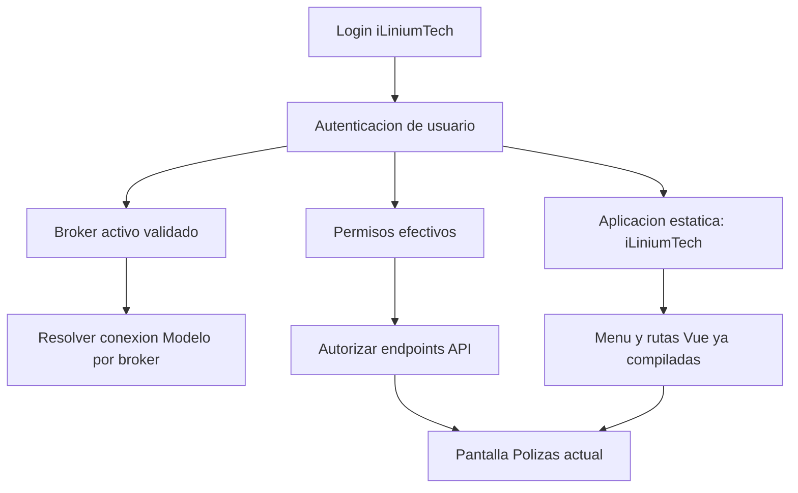

# Analisis AppBuilder: login, autenticacion, multitenant y aplicacion

Fecha: 2026-05-15

## Objetivo del analisis

Entender como AppBuilder relaciona autenticacion, broker/tenant y aplicacion para definir un MVP iLiniumTech con pantalla de login que, tras autenticarse, muestre la pantalla actual de polizas dentro del menu lateral.

Este documento no autoriza a convertir iLiniumTech en un runtime dinamico. La metadata AppBuilder solo se usa como evidencia de negocio y migracion.

## Fuentes revisadas

Frontend AppBuilder:

- `C:\Desarrollo\AppBuilder\src\frontend\shared\src\common\infrastructure\almacen\modules\AuthModule.ts`
- `C:\Desarrollo\AppBuilder\src\frontend\shared\src\entidades\builderMaster\auth\infrastructure\component\HelperLogin.ts`
- `C:\Desarrollo\AppBuilder\src\frontend\Builder\src\infrastructure\templates\prime\apollo\layout\AppSidebar.vue`

Backend AppBuilder:

- `C:\Desarrollo\AppBuilder\src\backend\Infraestructura\Apis\Intrasoft.ApiAuth\Controllers\TokenController.cs`
- `C:\Desarrollo\AppBuilder\src\backend\Infraestructura\Apis\Intrasoft.ApiAuth\Controllers\UserController.cs`
- `C:\Desarrollo\AppBuilder\src\backend\Infraestructura\Helper\Intrasoft.ApiBuilderCommon\Helper\HelperAuth.cs`
- `C:\Desarrollo\AppBuilder\src\backend\Infraestructura\Helper\Intrasoft.ApiBuilderCommon\Helper\HelperCommon.cs`
- `C:\Desarrollo\AppBuilder\src\backend\Infraestructura\Helper\Intrasoft.ApiBuilderCommon\Helper\HelperAppMaster.cs`
- `C:\Desarrollo\AppBuilder\src\backend\Infraestructura\Helper\Intrasoft.ApiBuilderCommon\Helper\HelperAppModel.cs`
- `C:\Desarrollo\AppBuilder\src\backend\Dominio\AppBuilder.Dominio\Entidades\Auth\LoginParameters.cs`
- `C:\Desarrollo\AppBuilder\src\backend\Dominio\AppBuilder.Dominio\Entidades\Auth\RespuestaAuth.cs`
- `C:\Desarrollo\AppBuilder\src\backend\Dominio\AppBuilder.Dominio\Entidades\Auth\RespuestaWhoAmI.cs`
- `C:\Desarrollo\AppBuilder\src\backend\Dominio\AppBuilder.Dominio\Entidades\Security\JwtData.cs`
- `C:\Desarrollo\AppBuilder\src\backend\Dominio\AppBuilder.Dominio\Entidades\Security\AppRelatedData.cs`
- `C:\Desarrollo\AppBuilder\src\backend\Dominio\AppBuilder.Dominio\Entidades\AppMaster\IapmUser.cs`
- `C:\Desarrollo\AppBuilder\src\backend\Dominio\AppBuilder.Dominio\Entidades\AppMaster\IapmUserEntityMain.cs`
- `C:\Desarrollo\AppBuilder\src\backend\Dominio\AppBuilder.Dominio\Entidades\AppMaster\IapmConnection.cs`

iLiniumTech:

- `docs/sdd/specs/iLiniumTech/SDD-2026-005-auth-permisos-producto.md`
- `docs/APPBUILDER_FLUJO_CONEXIONES_BROKER_POLIZAS.md`
- `docs/DECISION_PRODUCTO_ARQUITECTURA.md`
- `iLiniumTech.Backend\src\iLiniumTech.Backend.Api\Program.cs`
- `iLiniumTech.Backend\src\iLiniumTech.Backend.Api\Security\ApiKeyAuthenticationHandler.cs`
- `iLiniumTech.Backend\src\iLiniumTech.Backend.Api\Security\HeaderPolizasExecutionContextAccessor.cs`
- `iLiniumTech.Frontend\src\services\session.ts`
- `iLiniumTech.Frontend\src\router\index.ts`
- `iLiniumTech.Frontend\src\layout\AppShell.vue`
- `iLiniumTech.Frontend\src\layout\AppSideMenu.vue`

## Conceptos AppBuilder

### Usuario

En AppBuilder el usuario vive en Master como `IapmUser`. Campos relevantes:

- `Id`: identificador interno.
- `UserName`: normalmente email o nombre de login.
- `FullName`: nombre visible.
- `Password`, `PasswordExpireDate`, `Enabled`, `Locked`, `LoginTries`.
- `IsAdmin`.
- `ApplicationId` y `ApplicationVersion`.
- `EntityMainId`: entidad principal historica del usuario.
- `EntityMainCurrentId`: broker/tenant activo.
- `MicrosoftAccount` y `GoogleAccount`.

iLiniumTech no debe exponer este modelo directamente al frontend. Debe normalizarlo a un contrato propio de sesion.

### Broker, tenant o EntityMain

El broker efectivo aparece con varios nombres:

- `brokerId` en requests de login/cambio de perfil.
- `EntityMainCurrentId` en `IapmUser`.
- `currentBrokerId` en el frontend AppBuilder.
- `IdentityId` en `IAPM_Connection`.
- `brokerId` o `entityMainId` en contexto backend y `SESSION_CONTEXT`.

Regla importante: para polizas, el broker no es solo un filtro visual. Determina tambien que conexion de base de datos modelo se usa. El flujo heredado busca en Master las conexiones `IAPM_Connection` por `IdentityId == brokerId` y selecciona la conexion de tipo Modelo.

### Perfil y tipo de perfil

AppBuilder usa:

- `profileId`: perfil efectivo de usuario/entidad.
- `profileTypeId`: tipo funcional del perfil.
- `profiles`: lista serializada de perfiles permitidos.

Durante login/cambio de broker, si el perfil no viene completamente informado, AppBuilder lo resuelve contra la base Modelo mediante `IapmoUserEntity` e `IapmoEntityProfile`.

Para iLiniumTech, estos valores deben convertirse en permisos de producto o claims normalizados. No deben alimentar un motor dinamico de pantallas.

### Aplicacion

En AppBuilder, `applicationId` y `applicationVersion` no son un simple texto de branding. Participan en:

- seleccion de conexiones Builder/Master mediante `IAP_ApplicationConnection`;
- carga de configuracion;
- menus dinamicos;
- rutas dinamicas;
- aplicaciones relacionadas;
- opciones de usuario;
- auditoria y logs;
- validacion de licencia;
- resolucion de perfil.

En iLiniumTech, el concepto de aplicacion debe mantenerse como contexto de producto, no como generador de UI runtime. La aplicacion puede identificar `iLiniumTech`, version funcional y permisos disponibles, pero las pantallas siguen siendo Vue/TypeScript ya compilado.

## Flujo AppBuilder observado

### Login inicial

1. El frontend envia a `/api/token/auth` un `LoginParameters` con `grant_type`, credenciales, `applicationId` y `applicationVersion`.
2. `TokenController.Auth` delega en `HelperAuth.Auth`.
3. `HelperAuth.Auth` resuelve servicios Master para la aplicacion/version.
4. Busca el usuario por email, cuenta Microsoft, cuenta Google o API key segun el tipo de login.
5. Si viene `brokerId`, actualiza `IapmUser.EntityMainCurrentId`.
6. Carga servicios Modelo usando conexiones del broker activo.
7. Valida licencia de aplicacion para el broker.
8. Valida credenciales, MFA, bloqueo, expiracion de password o modo `login_with_builder`.
9. Genera o reutiliza token de dispositivo/sesion.
10. Resuelve conexiones del broker en `IAPM_Connection`.
11. Exige conexion Modelo.
12. Resuelve perfil efectivo.
13. Genera JWT y refresh token.
14. Incluye en el JWT datos cifrados con usuario, broker, app/version, perfil, conexiones y aplicaciones relacionadas.

### Cambio de broker o perfil

1. El usuario selecciona broker/perfil en UI.
2. `HelperLogin.changeEntity(...)` construye un request con `grant_type = login_with_builder`, `brokerId`, `profileId`, `profileTypeId`, app/version y `external`.
3. El frontend ejecuta `Actions.AUTH`.
4. AppBuilder permite este flujo si ya existe usuario autenticado coherente.
5. El backend genera un nuevo contexto/token para el broker/perfil elegido.
6. El frontend recarga menus y rutas dinamicas.

En iLiniumTech no debemos recargar menus desde metadata. Si se permite cambiar broker, el cambio debe refrescar `/api/me`, permisos y datos de pantalla, no reconstruir pantallas.

### whoAmI

`UserController.WhoAmI` devuelve usuario sanitizado parcialmente, opciones, broker actual, perfil, grupos y aplicaciones relacionadas. `WhoAmIProfiles` lista aplicaciones, brokers, perfiles y entidades accesibles.

iLiniumTech necesita un contrato mucho menor y mas estable:

- usuario visible minimo;
- broker activo;
- brokers permitidos;
- aplicacion activa;
- perfil/permisos efectivos;
- estado de contexto requerido para polizas.

## Estado actual iLiniumTech

Backend:

- Usa `ApiKeyAuthenticationHandler` con `X-ILiniumTech-Api-Key`.
- `/api/me` esta protegido por API key y devuelve contexto de polizas desde `IPolizasExecutionContextAccessor`.
- El contexto de polizas puede venir de configuracion o de cabeceras MVP si esta permitido.
- Las cabeceras MVP (`X-Broker-Id`, `X-User-Id`, `X-Profile-Id`, `X-Profile-Type-Id`, `X-Is-Admin`) no prueban identidad ni permisos.
- Los endpoints `/api/polizas/*` requieren autorizacion por API key y contexto de broker cuando aplica.

Frontend:

- No hay pantalla de login.
- La raiz redirige a `/polizas`.
- `/polizas` y detalle viven dentro de `AppShell` con menu lateral estatico.
- `useSession()` consume `/api/me` solo si `VITE_USE_BACKEND=true`; en modo local crea una sesion fixture desde `VITE_BROKER_ID`.
- El cliente aun depende de API key de entorno en modo backend.

## Decision de diseno para el MVP de login

El MVP debe introducir una experiencia de login sin fingir que ya existe autenticacion productiva completa.

La forma recomendada es hacer un **login de producto MVP**, con contrato propio iLiniumTech, y dos modos:

1. Modo demo/local para revision visual y avance de frontend.
2. Modo backend autenticado cuando se implemente el endpoint de login aprobado.

No se deben reutilizar literalmente `/api/token/auth`, `LoginParameters`, `JwtData` ni `whoAmI` de AppBuilder como contrato runtime iLiniumTech. Esos modelos arrastran conexiones, metadata, aplicaciones relacionadas y comportamiento dinamico.

## Contrato conceptual iLiniumTech

### Login request MVP

```json
{
  "username": "usuario.demo",
  "password": "********",
  "applicationKey": "iliniumtech",
  "brokerId": 42
}
```

Reglas:

- `applicationKey` identifica el producto estatico, no una fuente de pantallas.
- `brokerId` puede omitirse si el usuario tiene un unico broker permitido.
- No se aceptan perfiles ni permisos desde el frontend como autoridad.
- Las credenciales demo no deben estar hardcodeadas con secretos reales.

### Login response MVP

```json
{
  "session": {
    "expiresAt": "2026-05-15T18:00:00Z"
  },
  "user": {
    "id": "demo-user",
    "displayName": "Usuario demo"
  },
  "application": {
    "key": "iliniumtech",
    "name": "iLiniumTech"
  },
  "currentBrokerId": 42,
  "allowedBrokerIds": [42],
  "permissions": ["polizas.catalogs", "polizas.read", "polizas.detail"]
}
```

La respuesta anterior es conceptual y sanitizada. El backend final puede implementarla con cookie `HttpOnly` o token bearer segun decision de seguridad.

### `/api/me` objetivo

`/api/me` debe ser la fuente unica del frontend para saber:

- si hay sesion valida;
- quien es el usuario visible;
- cual es el broker activo;
- que brokers puede seleccionar;
- que aplicacion/producto esta activo;
- que permisos efectivos tiene;
- si falta contexto para consultar polizas.

## Relacion login, tenant y aplicacion en iLiniumTech



La aplicacion decide el producto y sus capacidades; no decide en runtime que componentes Vue existen. El broker decide alcance de datos y conexion. Los permisos deciden operaciones permitidas.

## MVP propuesto en pasos pequenos

### Paso 1: login visual y guard local

Objetivo: que el usuario vea primero `/login` y, al iniciar sesion demo, entre a la pantalla actual.

Alcance:

- ruta `/login`;
- pantalla Vue estatica de login;
- sesion demo guardada en `sessionStorage`;
- guard de router para proteger `/polizas` y detalle;
- boton salir en `AppShell`;
- no tocar backend;
- no cambiar contratos de polizas.

Limitacion declarada: no es autenticacion productiva; es una puerta de producto MVP para demo controlada.

### Paso 2: contrato backend de sesion MVP

Objetivo: sustituir la sesion local por un contrato backend controlado.

Alcance:

- `POST /api/auth/login`;
- `POST /api/auth/logout`;
- ampliar `/api/me`;
- mantener API key solo como proteccion tecnica temporal o reemplazarla por cookie/token segun decision;
- tests 401/403 basicos;
- errores sanitizados con `correlationId`.

### Paso 3: contexto autenticado para polizas

Objetivo: que `IPolizasExecutionContextAccessor` lea broker/usuario/perfil desde sesion validada antes que headers MVP.

Alcance:

- contexto interno autenticado;
- validacion de broker activo contra brokers permitidos;
- permisos `polizas.catalogs`, `polizas.read`, `polizas.detail`;
- headers MVP solo fallback local/demo.

### Paso 4: seleccion de broker si hay multiples

Objetivo: permitir que un usuario con varios brokers elija uno antes de entrar a polizas.

Alcance:

- selector en login o pantalla intermedia;
- endpoint de cambio de broker si el backend ya existe;
- invalidar cache/listados al cambiar broker.

## Preguntas funcionales pendientes

- Que proveedor de autenticacion productiva se quiere usar: credenciales propias, Microsoft Entra ID, Google, otro SSO o transicion por fases.
- Si el MVP demo debe aceptar credenciales locales configuradas por entorno o solo una sesion simulada frontend para revision visual.
- Que broker demo se usara en UAT y como se validara contra Master sin exponer secretos.
- Que permisos minimos debe tener el usuario demo.
- Si hay que permitir seleccion de aplicacion en login o iLiniumTech sera una aplicacion unica fija.
- Si hay que permitir seleccion de broker en el primer MVP o usar broker por defecto.

## Riesgos y mitigacion

- Riesgo: copiar contratos AppBuilder y arrastrar runtime dinamico.
  - Mitigacion: contrato iLiniumTech propio y pequeno; rutas Vue estaticas.
- Riesgo: presentar login demo como seguridad real.
  - Mitigacion: etiquetar modo demo, documentar limites y bloquear produccion hasta auth real.
- Riesgo: confiar en `X-Broker-Id` como identidad.
  - Mitigacion: claims/sesion tienen prioridad; headers solo fallback demo.
- Riesgo: exponer datos personales antes de permisos reales.
  - Mitigacion: mantener minimizacion actual de polizas y permisos read-only.
- Riesgo: no distinguir aplicacion de tenant.
  - Mitigacion: aplicacion = producto/capacidades; broker = alcance/conexion/datos.

## Estado incremental iLiniumTech

Fecha: 2026-05-15

- Paso 1 entregado: login visual estatico, guard de rutas, sesion local demo, logout y pruebas frontend.
- Paso 2 implementado como demo-session backend: `POST /api/auth/login`, `POST /api/auth/logout` y `/api/me` ampliado.
- Paso 3 iniciado: `IPolizasExecutionContextAccessor` prioriza claims/sesion antes que cabeceras MVP.
- Evidencia QA: `docs/qa/login-mvp-evidence.md`.

## Siguiente tarea recomendada

Avanzar en permisos efectivos sobre la base demo-session:

- definir politicas `polizas.catalogs`, `polizas.read` y `polizas.detail`;
- validar broker activo contra brokers permitidos de la sesion;
- mantener headers MVP solo como fallback local/demo hasta retirada controlada.
